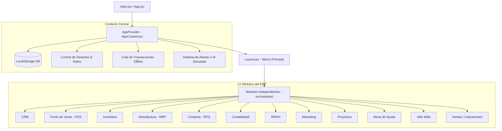
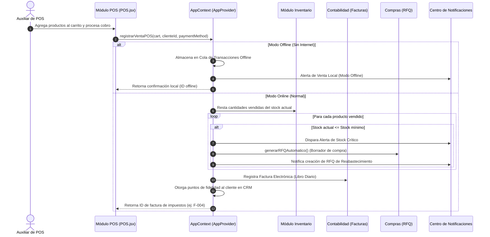

# Pharma-Sync ERP - Sistema Integrado de Farmacia Modular

Pharma-Sync ERP es un sistema empresarial modular diseñado a la medida para la gestión de farmacias. Está construido sobre **React**, **Vite** y **Lucide Icons**, estructurado como un monolito frontend reactivo que simula dinámicamente flujos de trabajo relacionales complejos (CRM, POS, Inventario, Manufactura, Compras, Contabilidad, Recursos Humanos, Mesa de Ayuda y E-commerce).

---

## 🏛️ Arquitectura del Sistema

El proyecto sigue una arquitectura **basada en Contexto Global y Módulos Desacoplados**. La lógica de negocio, persistencia de base de datos en almacenamiento local (LocalStorage) y flujos relacionales residen en el **Contexto Central**, mientras que las interfaces de usuario están segregadas en componentes independientes y módulos autocontenidos.



---

## 🔄 Secuencias y Flujos Relacionales Críticos

El núcleo de Pharma-Sync es la **integración de datos en tiempo real**. Los módulos no son vistas estáticas, sino que reaccionan de manera conjunta ante eventos clave.

### Secuencia: Venta en Punto de Venta (POS) con Alerta de Stock y Auto-Reabastecimiento

Cuando un operador POS procesa una venta, se desencadena una secuencia automatizada que actualiza el inventario, notifica al personal, genera la contabilidad y emite alertas de reabastecimiento en Compras.



---

## 📂 Desglose Detallado de Archivos y Carpetas

### Carpetas Raíz
*   `dist/`: Carpeta autogenerada al ejecutar `npm run build`. Contiene los recursos listos para producción (HTML compilado, JS y CSS minificados).
*   `public/`: Almacena recursos públicos estáticos como el favicon, logos o manifiestos del navegador.
*   `node_modules/`: Paquetes y dependencias del sistema instalados a través de NPM.

### Carpetas de Código (`src/`)

#### ⚙️ `src/context/`
*   `AppContext.jsx` **(El Corazón del Proyecto)**:
    *   **Función**: Define el `AppProvider` y el contexto compartido.
    *   **Contenido**: Inicializa los estados simulados de las bases de datos (Pacientes, Inventario, Fórmulas, Facturas, Compras, Empleados de RRHH, Tickets, Proyectos). Contiene los algoritmos centrales de venta (`registrarVentaPOS`), compras (`recibirCompra`), producción (`prepararFormulaMRP`), conciliación de cuentas por IA (`conciliarFacturaBancaria`) y validación de usuarios con roles y contraseñas.

#### 🧩 `src/components/`
*   `Layout.jsx`: Componente estructural que define la interfaz general del ERP (barra lateral de módulos, cabecera de usuario con notificaciones en tiempo real, selector de modo de simulación "Offline/Online", y conmutador de tema claro/oscuro).
*   `Login.jsx`: Pantalla de seguridad de inicio de sesión. Gestiona los estados de los campos (Usuario/Contraseña) y valida la entrada con el contexto del sistema. Se ha personalizado para remover los autocompletados demo públicos para mayor seguridad.
*   `MobileFrame.jsx`: Envuelve la interfaz en un visor interactivo que simula cómo se visualiza el ERP desde una tableta o dispositivo móvil de bodega.

#### 📦 `src/modules/ (Los 12 Módulos Funcionales)`
Cada carpeta contiene componentes reactivos autocontenivos para su visualización y operación:
1.  `CRM/`: Gestión de fichas de pacientes, historial de compras, acumulación de puntos por fidelidad de la farmacia y registro de tratamientos crónicos.
2.  `POS/`: Punto de venta interactivo. Permite buscar medicamentos en inventario, controlar el carrito de compras, seleccionar pacientes de la base de datos y simular pasarela de pagos.
3.  `Inventario/`: Monitor central de stock, códigos de lote, fechas de vencimiento con semáforos visuales de expiración, y reglas de reabastecimiento mínimo.
4.  `Manufactura/`: Módulo de fabricación (MRP) para Fórmulas Magistrales. Controla listas de ingredientes (BOM) y gestiona la preparación de jarabes y cremas personalizadas.
5.  `Compras/`: Control de solicitudes de cotización (RFQ). Los borradores se auto-generan por baja de existencias y se consolidan en órdenes de recepción física.
6.  `Contabilidad/`: Balance general, registros de facturación electrónica XML ante impuestos, y conciliaciones bancarias automáticas asistidas por IA.
7.  `RRHH/`: Marcaciones biométricas de entrada/salida de personal farmacéutico (Check-in/Check-out), control de asistencia en tiempo real y vacaciones acumuladas.
8.  `Marketing/`: Planificador de campañas masivas por correo electrónico y SMS segmentadas por tipo de paciente o enfermedad crónica.
9.  `Proyectos/`: Tableros Gantt y diagramas de avance para campañas de vacunación y apertura de nuevas sucursales físicas de la farmacia.
10. `MesaAyuda/`: Sistema de atención al cliente (Helpdesk) con SLA dinámico para resolver dudas farmacéuticas de pacientes.
11. `SitioWeb/`: Simula la tienda web pública (E-commerce) de la farmacia, pasarela de consultas digitales y chat en vivo integrado con el ERP.
12. `Ventas/`: Gestión de cotizaciones de compras a granel y contratos médicos institucionales.

#### 🎨 Estilos y Raíz (`src/`)
*   `index.css` **(Sistema de Diseño Visual Premium)**:
    *   **Función**: Define el sistema de variables globales (paleta de colores HSL, bordes redondeados glassmorphism, sombras elevadas, tipografías del sistema, animaciones de carga skeleton y transiciones fluidas de hover).
    *   **Tema Oscuro (Dark Mode)**: Soporte completo mediante el selector de datos `[data-theme='dark']`.
*   `App.jsx`: Componente raíz que maneja el enrutado lógico de autenticación. Si el usuario está logueado renderiza el `Layout` con sus módulos correspondientes; de lo contrario, muestra la pantalla de `Login`.
*   `main.jsx`: Punto de entrada de React. Monta la aplicación en el DOM del navegador y la envuelve dentro del `AppProvider` de contexto global.

---

## 🔑 Credenciales Seguras Configuradas

Las credenciales han sido blindadas bajo el patrón privado de seguridad solicitado (`usuario999`):

| Usuario | Contraseña | Rol Asignado | Módulos Autorizados |
| :--- | :--- | :--- | :--- |
| `admin` | **`admin999`** | Administrador | Todos los 12 módulos del sistema. |
| `farmacia` | **`farmacia999`** | Regente Farmacéutico | POS, Inventario, Manufactura, Mesa de Ayuda. |
| `contas` | **`contas999`** | Contador | Contabilidad, Ventas, Compras, CRM. |
| `RRHH` | **`RRHH999`** | Recursos Humanos | RRHH, Proyectos, Mesa de Ayuda. |
| `stock` | **`stock999`** | Encargado de Almacén | Inventario, Compras. |
| `market` | **`market999`** | Marketing y Web | Marketing, Sitio Web, CRM. |

---

## 🛠️ Guía de Despliegue en Internet (Render)

Para reflejar este desglose y las modificaciones de seguridad en tu servidor en la nube de Render:

1.  Asegúrate de estar posicionado en tu terminal dentro de la carpeta:
    `~/Documentos/GitHub/ODOO-ERP/ODOO-ERP`
2.  Ejecuta estos comandos en tu terminal para registrar y subir todo el trabajo nuevo a tu GitHub:
    ```bash
    git add .
    git commit -m "Completar README y asegurar credenciales privadas de Pharma-Sync"
    git push origin main
    ```
3.  **Render** detectará este *push* en tu rama `main` en menos de 10 segundos, iniciará una nueva compilación y en un par de minutos tu sitio web estará actualizado y protegido en internet.
