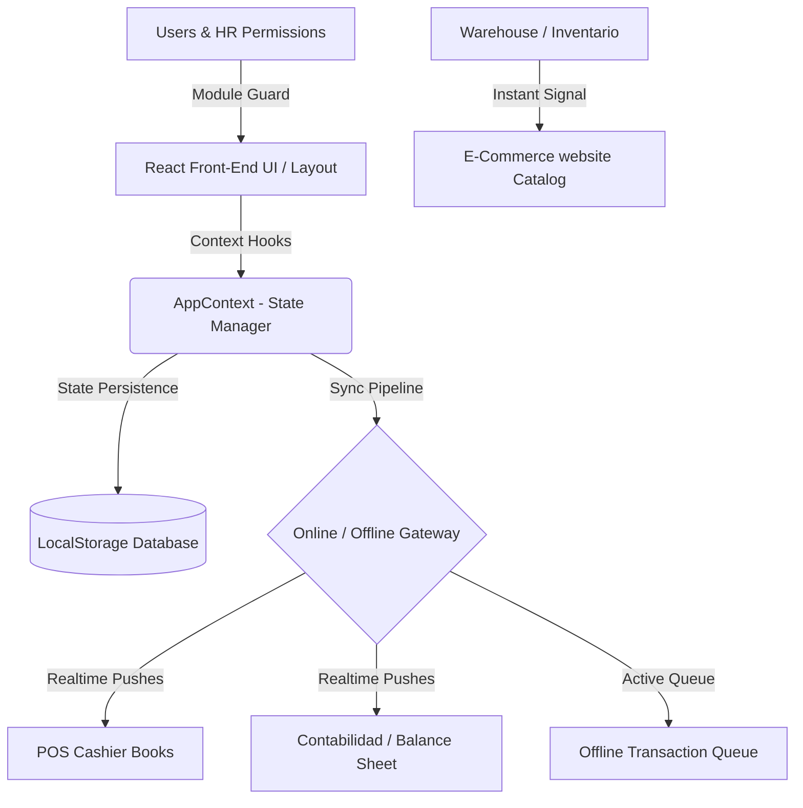

# 💊 Pharma-Sync ERP — Modern Pharmaceutical Odoo Suite

<div align="center">
  
  
  [](https://react.dev)
  [](https://vitejs.dev)
  [](https://developer.mozilla.org/css)
  [](https://github.com)
</div>

---

### 🌟 Resumen del Proyecto

**Pharma-Sync ERP** es un ecosistema digital avanzado e interactivo de nivel empresarial (ERP) inspirado en **Odoo**, diseñado específicamente para la administración integral de cadenas de farmacias, laboratorios y atención al paciente. 

El sistema cuenta con una interfaz **premium ultra-moderna** basada en neumorfismo, glassmorfismo y esquemas adaptativos de color (Día/Noche), ofreciendo una experiencia responsiva excepcional que funciona de manera nativa tanto en dispositivos móviles (modo carrusel táctil) como en pantallas de escritorio.

---

## 🛠️ Arquitectura y Tecnologías Clave



*   **Front-End Core**: React 18 + Vite para una compilación ultra-veloz en milisegundos.
*   **State Management (Global)**: React Context API (`AppContext.jsx`) que centraliza el estado relacional de inventarios, compras, ventas, tickets de soporte y recursos humanos.
*   **Base de Datos Híbrida local**: Mecanismos de doble persistencia bidireccional en `LocalStorage` que retienen la información del sistema de manera perpetua al cambiar de pestañas, apagar el dispositivo o recargar la página.
*   **Offline Mode Engine**: Cola de transacciones sin conexión (`OfflineQueue`) que acumula las ventas realizadas en el POS si se cae la red y las procesa automáticamente al recuperar la señal, impactando los libros contables y el almacén al instante.

---

## 📦 Recorrido por los Módulos del Sistema

| Icono | Módulo | Descripción Funcional | Características Destacadas |
| :---: | :---: | :---: | :---: |
| 👥 | **CRM** | Gestión inteligente de pacientes y retención. | Kanban interactivo de leads, chat de soporte médico en vivo, segmentación por enfermedades. |
| 📈 | **Ventas** | Registro e histórico de transacciones comerciales. | Emisión de cotizaciones formales, facturas timbradas electrónicamente y métricas de ingresos. |
| 💼 | **Contabilidad** | Control de activos, ingresos y egresos. | Conciliación bancaria en un clic, cálculo automático de saldos e impuestos, balances visuales. |
| 📦 | **Inventario** | Control de almacén físico en tiempo real. | Alertas por fecha de vencimiento, lote de bodega, reabastecimiento rápido (`+10`, `+50`, `+100` u) y eliminación segura. |
| 🛒 | **Compras** | Gestión de abastecimiento con laboratorios. | Emisión automática de RFQs a laboratorios líderes (BAGO, INTI) cuando el stock cae bajo el mínimo. |
| 🧪 | **Manufactura (MRP)** | Elaboración de fórmulas magistrales en laboratorio. | Registro de fórmulas farmacéuticas, mezclador de ingredientes y deducción automática de materia prima. |
| 👥 | **RRHH** | Fichaje, roles corporativos y control de personal. | Checador digital (Check-In/Out) con registro de horas, cálculo de vacaciones y gestor de permisos de usuario. |
| 🖥️ | **Punto de Venta (POS)** | Caja registradora táctil optimizada para farmacéuticos. | Buscador rápido de medicamentos con lectura de código simulada, emisión de recibos y cobros integrados. |
| 🌐 | **Sitio Web** | Portal e-commerce interactivo para el cliente. | Catálogo de venta al público sincronizado con almacén, pasarela de pago virtual y chat de consulta directa. |
| 📣 | **Marketing** | Campañas de fidelización masivas. | Envío simulado de alertas SMS y correos masivos para pacientes crónicos con analíticas de clics. |
| 📅 | **Proyectos** | Planificación de campañas y expansiones de sucursales. | Diagrama de tareas, indicadores de completado y asignación de responsables interdepartamentales. |
| 💬 | **Mesa de Ayuda** | Centro de atención al cliente y consultas médicas. | Apertura de tickets de consultas de salud con seguimiento de SLA y respuestas del Regente Farmacéutico. |

---

## 📂 Estructura de Directorios

```text
ODOO-ERP/
├── dist/                     # Carpeta de distribución compilada en producción
├── public/                   # Activos estáticos (imágenes, iconos, manifiestos)
├── src/                      # Código fuente del proyecto
│   ├── components/           # Componentes estructurales reutilizables
│   │   └── Layout.jsx        # Contenedor global, menús responsivos y barra de perfil
│   ├── context/              # Contexto de React
│   │   └── AppContext.jsx    # Motor contable, base de datos simulada y sincronizador offline
│   ├── modules/              # Submódulos funcionales de la suite ERP
│   │   ├── CRM/
│   │   ├── Ventas/
│   │   ├── Contabilidad/
│   │   ├── Inventario/       # Lógica de almacén, códigos de lote y botones rápidos de ajuste
│   │   ├── Compras/
│   │   ├── Manufactura/
│   │   ├── RRHH/             # Gestor de usuarios, credenciales y perfiles de acceso
│   │   ├── Punto de Venta/
│   │   ├── Sitio Web/        # Simulador e-commerce sincronizado con el stock central
│   │   ├── Marketing/
│   │   ├── Proyectos/
│   │   └── Mesa de Ayuda/
│   ├── App.jsx               # Enrutador e inicializador general del sistema
│   ├── index.css             # Tokens CSS premium, fuentes Google, scrollbars y glassmorfismo
│   └── main.jsx              # Punto de entrada de la aplicación en el DOM
├── package.json              # Manifiesto de dependencias npm
├── vite.config.js            # Configuración del empaquetador Vite
└── README.md                 # Documentación técnica de referencia
```

---

## 🚀 Instalación y Despliegue en Entorno Local

Sigue estos sencillos pasos para clonar el repositorio, ejecutar el entorno de desarrollo y compilar para producción:

### 1. Requisitos Previos
Asegúrate de tener instalado **Node.js** (versión 16.x o superior) y **npm** en tu sistema operativo.

### 2. Instalación de Dependencias
Abre tu terminal dentro de la carpeta raíz del proyecto y ejecuta:
```bash
npm install
```

### 3. Ejecución del Servidor de Desarrollo
Para lanzar el servidor interactivo con Hot Module Replacement (HMR):
```bash
npm run dev
```
*El sistema se abrirá automáticamente en tu navegador local en la dirección: `http://localhost:5173`.*

### 4. Compilación y Previsualización para Producción
Si deseas auditar la compilación optimizada de producción a nivel local:
```bash
npm run build
npm run preview
```
*Este comando compilará los activos en la carpeta `dist/` y levantará un servidor local ultra-rápido en la dirección: `http://localhost:4173`.*

---

## 🎨 Guía de Diseño Visual y Experiencia UX/UI

> [!NOTE]
> **Diseño de Alta Fidelidad**: La suite no utiliza plantillas genéricas. Se ha estructurado un set exclusivo de variables CSS (`--primary`, `--danger`, `--bg-card`, etc.) que adaptan su opacidad e iluminación en tiempo real de acuerdo a la luz ambiental seleccionada.

> [!TIP]
> **Micro-animaciones de Entrada**: Cada módulo cuenta con transiciones `ease-out` al cargarse, haciendo que el cambio de interfaz sea sumamente suave y prevenga la fatiga visual del operario en turnos largos.

> [!IMPORTANT]
> **Seguridad de Operaciones Críticas**: Los formularios y botones de eliminación permanente en Almacén cuentan con confirmaciones visuales explícitas y sistemas de limpieza de caché automática para proteger la integridad contable del ERP.

---

<div align="center">
  <p>Desarrollado con ❤️ para <b>Pharma-Sync Suite</b> — El estándar del futuro en la gestión farmacéutica moderna.</p>
</div>
