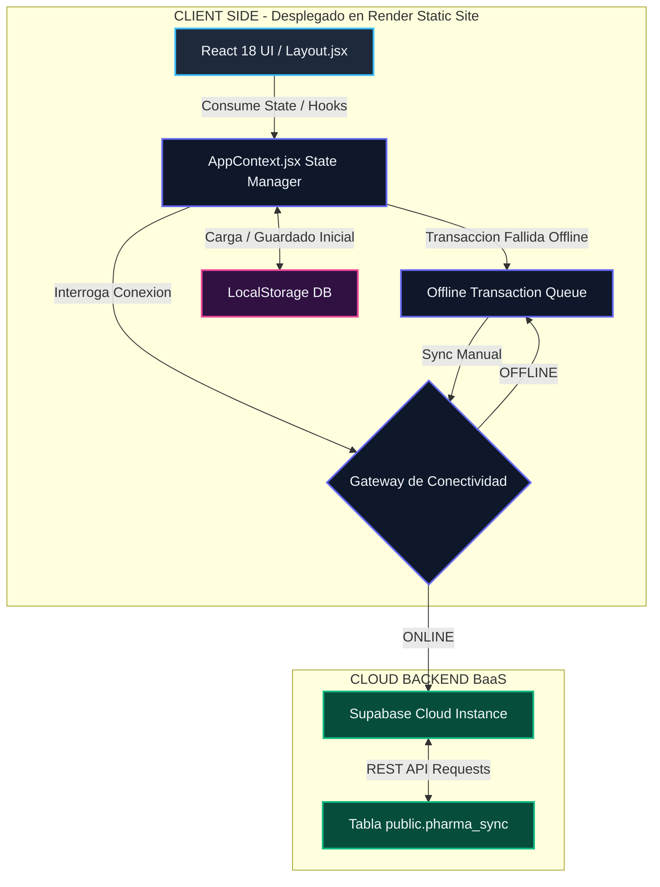

# 💊 Pharma-Sync ERP — Modern Pharmaceutical Odoo Suite

<div align="center">
  
  
  [](https://react.dev/)
  [](https://vite.dev/)
  [](https://supabase.com)
  [](https://render.com)
  [](https://developer.mozilla.org/css)
  [](LICENSE)
</div>

---

### 🌟 Resumen Ejecutivo
**Pharma-Sync ERP** es un ecosistema digital avanzado e interactivo de nivel empresarial (inspirado en la suite modular de **Odoo**) diseñado específicamente para la administración integral de cadenas de farmacias, laboratorios y atención clínica. Su arquitectura modular desacoplada opera bajo un esquema de **Doble Persistencia Reactiva Híbrida** (LocalStorage + Supabase Cloud), garantizando total resiliencia operativa mediante colas de transacciones offline y una interfaz premium neumórfica/glassmórfica adaptativa de última generación.

---

## 🏛️ Arquitectura del Sistema y Tech Stack

La suite Pharma-Sync está construida bajo los más altos estándares de desarrollo frontend moderno y servicios distribuidos:



### 💻 Desglose del Stack Tecnológico
*   **Frontend Core**: **React 18.3.1** (Arquitectura funcional basada en Context Hooks y renderizado concurrente).
*   **Gestor de Empaquetado**: **Vite v5.4.10** (Configuración optimizada de Hot Module Replacement para cargas ultra-veloces).
*   **Base de Datos en Servidor (BaaS)**: **Supabase** (Motor relacional PostgreSQL en la nube). Consumo optimizado mediante peticiones HTTP asíncronas directas al endpoint REST, evitando dependencias pesadas y garantizando compatibilidad multiplataforma.
*   **Doble Persistencia**: Sincronizadores en segundo plano mediante `useEffect` que guardan y cargan el estado local instantáneamente en el navegador, espejándolo asíncronamente en Supabase.
*   **Estilos y UX**: CSS3 Vanilla modular basado en **Tokens HSL variables** para dar soporte nativo a los temas claro/oscuro mediante selectores de atributos `data-theme`.

---

## 🔀 Flujo de Datos Relacionales (Deep Dive)

La principal ventaja del sistema es la integración automatizada entre módulos. Cuando un evento ocurre en un módulo, se desencadena una cascada de transacciones lógicas en el motor del `AppContext.jsx`:

```text
                                 [ Módulo POS ]
                                        │
                           (Registrar Venta de Fármaco)
                                        │
                                        ▼
                             [ AppContext Engine ]
                                        │
         ┌──────────────────────────────┼──────────────────────────────┐
         ▼                              ▼                              ▼
 [ Módulo Inventario ]       [ Módulo Contabilidad ]             [ Módulo CRM ]
   Restar Unidades             Generar Factura XML            Acumular Puntos
         │                              │                              │
(¿Stock < Mínimo?)                      │                              │
         │                              ▼                              ▼
         ▼                      [ Conciliación IA ]           [ Ficha Paciente ]
  [ Módulo Compras ]             Match Bancario               Historial Clínico
Generar RFQ Automático
```

---

## 🚀 Características Principales (Core Modules)

El sistema cuenta con **12 módulos funcionales autocontenidos** altamente integrados en el cliente y la base de datos distribuida:

### 1. 👥 CRM & Fidelidad de Pacientes
*   **Funcionalidades**: Fichas clínicas detalladas, historial de tratamientos médicos crónicos, administración de puntos de recompensa por compras.
*   **Visualización**: Tablero Kanban interactivo para el seguimiento de leads comerciales y segmentación inteligente de pacientes hipertenso/diabéticos.

### 2. 📈 Ventas e Ingresos
*   **Funcionalidades**: Emisión y control de cotizaciones corporativas, aprobación de contratos de distribución mayorista y visualización analítica de ganancias mensuales.
*   **Integración**: Interconectado directamente con el módulo contable para provisionar ingresos automáticamente.

### 3. 💼 Contabilidad y Conciliación bancaria
*   **Funcionalidades**: Libro mayor de transacciones, visualización del balance general activo, impuestos autocalculados (simulación XML de facturas electrónicas).
*   **Tecnología Clave**: Conciliación automática de facturas mediante un algoritmo de coincidencia que simula auditoría por Inteligencia Artificial.

### 4. 📦 Inventario y Almacén Físico
*   **Funcionalidades**: Control estricto de stocks, semáforos visuales de proximidad de vencimiento y ajuste rápido de unidades (`+10`, `+50`, `+100` u).
*   **Seguridad**: Confirmaciones explícitas de eliminación permanente para salvaguardar la consistencia operativa.

### 5. 🛒 Compras y Auto-RFQ
*   **Funcionalidades**: Registro de proveedores farmacéuticos nacionales (BAGO, INTI), historial de recepciones y automatización de reabastecimiento.
*   **Flujo Inteligente**: Cuando el inventario de un fármaco cae por debajo de su límite crítico, el sistema genera de forma autónoma una Orden de Compra (RFQ) en estado "Borrador".

### 6. 🧪 Manufactura (MRP)
*   **Funcionalidades**: Registro de fórmulas magistrales farmacéuticas y mezclador de reactivos/ingredientes activos.
*   **Impacto Contable**: Al fabricar un producto final, el sistema resta automáticamente el stock de materias primas e inyecta los costos de fabricación simulados en la contabilidad general.

### 7. 👥 Recursos Humanos (RRHH)
*   **Funcionalidades**: Administración de turnos y vacaciones del personal médico y administrativo.
*   **Herramienta**: Checador digital biométrico (Check-In/Out) interactivo que captura el inicio/fin de jornada y calcula horas laboradas.

### 8. 🖥️ Punto de Venta (POS)
*   **Funcionalidades**: Interfaz táctil de caja registradora ultrarrápida, barra de búsqueda reactiva por categorías de medicamentos y visor de recibo electrónico imprimible.
*   **Uso**: Optimizado con simulación de lector de códigos de barras.

### 9. 🌐 Sitio Web & E-Commerce
*   **Funcionalidades**: Portal comercial público en línea que expone el catálogo sincronizado directamente con la disponibilidad física del almacén central.
*   **UX**: Pasarela de pago virtual integrada y chat médico de soporte técnico interactivo.

### 10. 📣 Marketing y Fidelización
*   **Funcionalidades**: Gestor de campañas de difusión masiva (SMS y correo electrónico).
*   **Métricas**: Analíticas simuladas de clics, tasa de apertura y éxito de conversión en pacientes suscritos.

### 11. 📅 Proyectos y Expansiones
*   **Funcionalidades**: Planificación de campañas de salud pública y apertura de nuevas sucursales mediante listas de tareas ágiles con indicador de porcentaje de completado.

### 12. 💬 Mesa de Ayuda (Helpdesk)
*   **Funcionalidades**: Sistema de tickets para soporte técnico de farmacia y tele-consultas de salud administrado bajo niveles de acuerdo de servicio (SLA).

---

## 🔄 El Pipeline de Sincronización en Supabase

La persistencia híbrida interactúa con Supabase de manera directa y optimizada. A continuación, se expone el funcionamiento del motor de sincronización.

### 1. Lectura Inicial (Startup Sync)
Al arrancar la aplicación, se consulta a Supabase cada dataset clave (`db_inventario`, `db_pacientes`, etc.) utilizando peticiones HTTP `GET` autenticadas por la Anon Key:
```javascript
const fetchFromSupabase = async (key) => {
  const url = localStorage.getItem('supabase_url');
  const apiKey = localStorage.getItem('supabase_key');
  if (!url || !apiKey) return null;

  try {
    const cleanUrl = url.replace(/\/$/, "");
    const res = await fetch(`${cleanUrl}/rest/v1/pharma_sync?key=eq.${key}&select=value`, {
      method: 'GET',
      headers: {
        'apikey': apiKey,
        'Authorization': `Bearer ${apiKey}`
      }
    });
    if (res.ok) {
      const data = await res.json();
      return data[0]?.value || null;
    }
  } catch (err) {
    console.error('Failed to fetch from Supabase:', err);
  }
  return null;
};
```

### 2. Escritura y Resolución de Conflictos (Upsert Pipeline)
Cada actualización en los estados reactivos del ERP genera un re-guardado en LocalStorage y dispara asíncronamente un `POST` al endpoint REST de Supabase. Para prevenir sobreescrituras accidentales en sistemas distribuidos, se utiliza la cabecera `'Prefer': 'resolution=merge-duplicates'` que fuerza un comportamiento de **Upsert** automático:
```javascript
const saveToSupabase = async (key, val) => {
  const url = localStorage.getItem('supabase_url');
  const apiKey = localStorage.getItem('supabase_key');
  if (!url || !apiKey) return;

  try {
    const cleanUrl = url.replace(/\/$/, "");
    await fetch(`${cleanUrl}/rest/v1/pharma_sync`, {
      method: 'POST',
      headers: {
        'apikey': apiKey,
        'Authorization': `Bearer ${apiKey}`,
        'Content-Type': 'application/json',
        'Prefer': 'resolution=merge-duplicates'
      },
      body: JSON.stringify({ key, value: val, updated_at: new Date().toISOString() })
    });
  } catch (err) {
    console.error('Failed to sync to Supabase:', err);
  }
};
```

---

## 📶 Algoritmo de Resiliencia Offline

Si el ERP se queda sin conexión de red durante el registro de transacciones críticas en el POS, entra en funcionamiento la cola de transacciones locales (`OfflineQueue`).

```text
[ Venta en POS ] ──► ¿Conexión Activa? 
                        ├───► SI ──► Procesar de forma inmediata (Online)
                        └───► NO ──► Registrar ID temporal (ej. OFF-1234)
                                      │
                                      ▼
                             Guardar en OfflineQueue
                                      │
                         (Almacenado localmente en caché)
                                      │
                          [ Restaurar Conexión ]
                                      │
                                      ▼
                        Sincronizar Cola mediante FIFO
```

1.  **Captura**: El estado de red `isOnline` cambia a `false`.
2.  **Encapsulado**: El método `registrarVentaPOS` intercepta el carrito de compras, le asigna un identificador temporal `OFF-XXXX` y añade la venta al array `offlineQueue` en LocalStorage.
3.  **Restauración**: Una vez la conectividad se restablece, el usuario puede presionar **Sincronizar Datos** en el banner superior.
4.  **Ejecución FIFO**: El sistema itera sobre la cola, procesa secuencialmente cada orden pendiente y vacía la cola local, actualizando el stock y emitiendo las facturas en la base de datos central de Supabase.

---

## 📂 Estructura de Directorios Detallada

El proyecto cuenta con una separación limpia y estructurada de componentes React, módulos de lógica de negocios e inicialización del empaquetador:

```text
ODOO-ERP/
├── ODOO-ERP/                      # Directorio principal de la aplicación React
│   ├── dist/                      # Compilación estática de producción optimizada por Vite
│   ├── public/                    # Archivos estáticos, iconos y metadatos del sitio
│   ├── src/                       # Código fuente principal de la aplicación
│   │   ├── assets/                # Imágenes de medicamentos y elementos multimedia de marca
│   │   ├── components/            # Componentes de la interfaz de usuario general
│   │   │   ├── Layout.jsx         # Frame principal del ERP: Sidebar de navegación, Header, alertas de red
│   │   │   ├── Login.jsx          # UI y validación de credenciales del personal administrativo
│   │   │   └── MobileFrame.jsx    # Simulador responsivo táctil (Iframe/Phone frame para test de UX)
│   │   ├── context/               # Lógica del motor del ERP y sincronización de datos
│   │   │   └── AppContext.jsx     # Contexto global, persistencia híbrida, triggers e integración Cloud
│   │   ├── modules/               # Módulos funcionales de la suite (12 directorios desacoplados)
│   │   │   ├── CRM/               # Vistas de leads, segmentación clínica y Kanban interactivo
│   │   │   ├── Compras/           # Gestión de proveedores nacionales e ingreso físico de lotes
│   │   │   ├── Contabilidad/      # Módulo fiscal, balance general e integración IA bancaria
│   │   │   ├── Inventario/        # Control de semáforos de stock, fechas de vencimiento y códigos de lote
│   │   │   ├── Manufactura/       # MRP, recetas farmacéuticas magistrales y costos de materias primas
│   │   │   ├── Marketing/         # Envío simulado de SMS/Email con control analítico de clics
│   │   │   ├── MesaAyuda/         # Helpdesk con soporte médico, niveles de SLA y tickets abiertos
│   │   │   ├── POS/               # Punto de Venta táctil optimizado para terminales de caja
│   │   │   ├── Proyectos/         # Diagrama Gantt y listas de tareas interdepartamentales
│   │   │   ├── RRHH/              # Relación de personal, vacaciones e historial de entradas/salidas
│   │   │   ├── SitioWeb/          # E-Commerce interactivo al público y chat virtual en tiempo real
│   │   │   └── Ventas/            # Cotizaciones a granel e histórico de facturación mayorista
│   │   ├── App.css                # Estilos globales de navegación e interactividad base
│   │   ├── App.jsx                # Enrutador principal y validador de perfiles
│   │   ├── index.css              # Tokens de diseño CSS (Variables HSL, scrollbars personalizadas, temas)
│   │   └── main.jsx               # Renderizador principal del DOM de React
│   ├── eslint.config.js           # Reglas de buenas prácticas y análisis estático
│   ├── index.html                 # Esqueleto HTML5
│   ├── package.json               # Dependencias de npm y scripts de ejecución
│   └── vite.config.js             # Configuración del servidor y de hosts autorizados (Vite)
├── .gitattributes                 # Atributos de Git para codificación y fin de línea
├── LICENSE                        # Licencia del proyecto (MIT)
└── README.md                      # Este documento (Documentación raíz del repositorio)
```

---

## ⚙️ Configuración de Variables de Entorno

El ERP utiliza un sistema híbrido. Se pueden pre-inyectar variables en tiempo de compilación o configurarlas dinámicamente en tiempo de ejecución en la UI del ERP (guardadas de forma segura en LocalStorage):

| Variable / Clave | Destino de Configuración | Requerido | Propósito Funcional | Formato de Ejemplo |
| :--- | :--- | :--- | :--- | :--- |
| `supabase_url` | Modal de Perfil / LocalStorage | **SI** | Endpoint de conexión REST de la base de datos Supabase | `https://xzyabc123.supabase.co` |
| `supabase_key` | Modal de Perfil / LocalStorage | **SI** | Clave pública anónima (Anon Key) de Supabase | `eyJhbGciOiJIUzI1NiIsInR5cCI6...` |
| `VITE_API_URL` | Archivo `.env` en raíz | *Opcional* | Dirección base de APIs externas | `https://api.pharma-sync.com` |
| `PORT` | Archivo `.env` en raíz | *Opcional* | Puerto del servidor de previsualización local | `10000` |

### 🗄️ Esquema SQL de la Base de Datos
Para activar el motor en la nube, debes levantar la tabla `pharma_sync` en tu consola SQL de Supabase:

```sql
-- Crear la tabla pharma_sync en el esquema public
create table public.pharma_sync (
  key text primary key,
  value jsonb not null,
  updated_at timestamp with time zone default now()
);

-- Habilitar seguridad a nivel de filas (RLS)
alter table public.pharma_sync enable row level security;

-- Crear políticas de acceso para el rol público anon
create policy "Habilitar lectura publica anon" 
  on public.pharma_sync 
  for select 
  using (true);

create policy "Habilitar escritura publica anon" 
  on public.pharma_sync 
  for insert 
  with check (true);

create policy "Habilitar edicion publica anon" 
  on public.pharma_sync 
  for update 
  using (true);
```

### 📄 Ejemplo del Payload JSON de Persistencia
Supabase almacena en la columna `value` de la tabla `pharma_sync` el estado serializado completo de los módulos del ERP. Un ejemplo de datos para la clave `db_inventario` es:

```json
{
  "key": "db_inventario",
  "value": [
    {
      "id": "p1",
      "nombre": "Paracetamol 500mg",
      "stock": 45,
      "lote": "L-PAR202",
      "vencimiento": "2027-10-15",
      "minStock": 20,
      "precio": 2.5,
      "categoria": "Analgesia",
      "imagen": "https://images.unsplash.com/photo-1584308666744-24d5c474f2ae?w=400&q=80"
    },
    {
      "id": "p2",
      "nombre": "Ibuprofeno 400mg",
      "stock": 12,
      "lote": "L-IBU304",
      "vencimiento": "2026-06-30",
      "minStock": 15,
      "precio": 3.8,
      "categoria": "Antiinflamatorio",
      "imagen": "https://images.unsplash.com/photo-1607619056574-7b8f304b3b8a?w=400&q=80"
    }
  ],
  "updated_at": "2026-05-31T22:15:30.123Z"
}
```

---

## 🛠️ Instalación y Despliegue Local (Paso a Paso)

Sigue estos sencillos pasos para tener el entorno de desarrollo operando en tu computadora local:

### 1. Prerrequisitos de Sistema
Asegúrate de contar con las siguientes herramientas instaladas:
*   **Node.js**: Versión LTS `v18.0.0` o superior (Recomendado `v20.x`).
*   **npm**: Versión `v9.x` o superior (incluido por defecto con Node).

### 2. Clonar el repositorio y acceder a la carpeta principal
```bash
git clone https://github.com/Gengar-pro/ODOO-ERP.git
cd ODOO-ERP
```

### 3. Instalar las dependencias en el subdirectorio de producción
```bash
cd ODOO-ERP
npm install
```

### 4. Lanzar el Servidor Local en Desarrollo
```bash
npm run dev
```
*Vite levantará el servidor interactivo HMR. Abre en tu navegador la dirección: `http://localhost:5173`.*

### 5. Conectar con la Nube de Supabase
1. Inicie sesión en el sistema usando cualquiera de las credenciales de rol descritas abajo.
2. Presione el botón **Configuración ⚙️** (esquina superior derecha).
3. En la sección **Base de Datos en la Nube (Supabase)**, pegue su URL del proyecto y su Anon API Key.
4. Haga clic en **Guardar Perfil**. El sistema recargará la pestaña automáticamente e importará la información actual de la base de datos en la nube.

---

## 🔑 Credenciales Seguras de los Roles de Acceso

El acceso al ERP está protegido por perfiles de usuario. Las credenciales seguras configuradas en base de datos son:

| Usuario | Contraseña | Rol Asignado | Módulos Autorizados en la Suite |
| :--- | :--- | :--- | :--- |
| `admin` | **`admin999`** | Administrador | **Acceso Total** a los 12 módulos funcionales. |
| `farmacia` | **`farmacia999`** | Regente Farmacéutico | POS, Inventario, Manufactura, Mesa de Ayuda. |
| `contas` | **`contas999`** | Contador General | Contabilidad, Ventas, Compras, CRM. |
| `RRHH` | **`RRHH999`** | Recursos Humanos | RRHH, Proyectos, Mesa de Ayuda. |
| `stock` | **`stock999`** | Encargado Almacén | Inventario, Compras. |
| `market` | **`market999`** | Especialista Marketing | Marketing, Sitio Web, CRM. |

---

## 🌐 Despliegue en Producción (Render.com)

El ERP se encuentra completamente operativo y desplegado de manera continua en la plataforma de Render.com. Para recrear o configurar el pipeline de integración continua (CI/CD) para nuevas ramas, siga esta plantilla de configuración:

1.  **Tipo de Servicio**: `Static Site` (Sitio web estático).
2.  **Root Directory**: `ODOO-ERP` (indica a Render que debe ejecutar los comandos dentro de la subcarpeta del proyecto React).
3.  **Build Command**: `npm install && npm run build`
4.  **Publish Directory**: `dist`
5.  **Headers de SPA (Redirecciones)**:
    Para evitar errores `404 Not Found` en navegadores al refrescar rutas personalizadas en aplicaciones React que utilizan enrutadores lógicos en el cliente, configure la siguiente regla de redirección (*Rewrite Rule*) en la consola de Render:
    *   **Source**: `/*`
    *   **Destination**: `/index.html`
    *   **Action**: `Rewrite`

---

## 🎨 Guía de Diseño Visual y Experiencia UX/UI

> [!NOTE]
> **Diseño de Alta Fidelidad**: La suite no utiliza plantillas genéricas. Se ha estructurado un set exclusivo de variables CSS (`--primary`, `--danger`, `--bg-card`, etc.) que adaptan su opacidad e iluminación en tiempo real de acuerdo al tema seleccionado.

> [!TIP]
> **Micro-animaciones de Entrada**: Cada módulo cuenta con transiciones `ease-out` al cargarse, haciendo que el cambio de interfaz sea sumamente suave y prevenga la fatiga visual del operario en turnos de trabajo prolongados.

> [!IMPORTANT]
> **Seguridad de Operaciones Críticas**: Los formularios y botones de eliminación permanente en Almacén cuentan con confirmaciones visuales explícitas y sistemas de limpieza de caché automática para proteger la integridad contable del ERP.

---

## 👥 Autores y Contribución

¡Las contribuciones mantienen el proyecto con calidad de software empresarial! Siga los estándares de Git Flow y Conventional Commits:

*   **Gengar-pro** — *Lead Architect & Frontend Developer* — [GitHub Perfil](https://github.com/Gengar-pro)
*   **Antigravity AI** — *Pair Programmer & Senior Technical Writer*

---

<div align="center">
  <p>Desarrollado para <b>Pharma-Sync Suite</b> — El estándar del futuro en la gestión farmacéutica moderna.</p>
</div>
