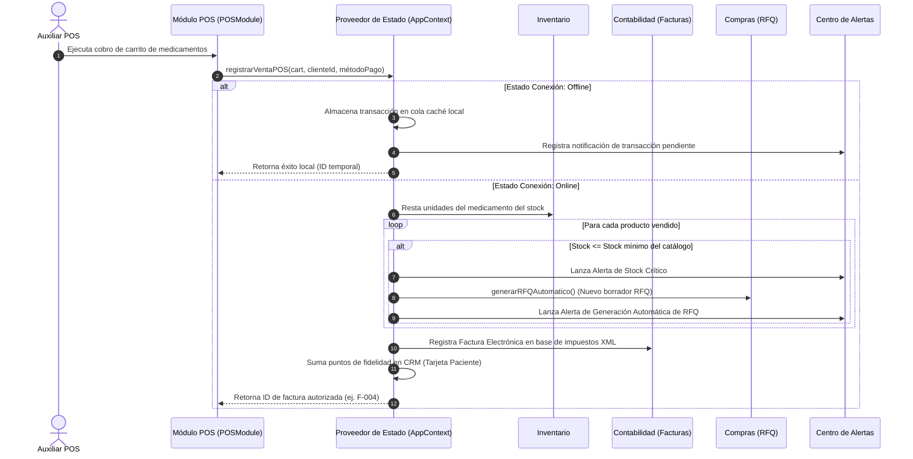

# Pharma-Sync ERP — Sistema Integrado de Farmacia Modular

[](https://react.dev/)
[](https://vite.dev/)
[](LICENSE)
[]()
[]()

Pharma-Sync ERP es una solución integral y robusta diseñada para optimizar los flujos operativos, comerciales y administrativos en el sector farmacéutico. El sistema implementa una arquitectura monolítica reactiva de última generación que simula flujos empresariales interconectados de alta fidelidad, con soporte nativo de visualización responsiva móvil, simulación offline y roles de acceso seguros.

---

## 🏛️ Arquitectura del Sistema y Tech Stack

El núcleo de Pharma-Sync opera bajo un patrón de **Gestión de Estado Centralizado y Módulos Desacoplados**. La lógica relacional se encuentra encapsulada en el contexto global, permitiendo a los módulos individuales comportarse como clientes de una base de datos distribuida.

### Tecnologías Principales:
*   **Frontend**: React (v18.3), JavaScript ES6+ (arquitectura funcional).
*   **Diseño y Estilos**: CSS3 Vanilla (sistema de diseño premium basado en tokens HSL, glassmorphism y dark mode nativo mediante selectores `data-theme`).
*   **Iconografía**: Lucide Icons (gráficos vectoriales interactivos).
*   **Entorno de Construcción (Bundling)**: Vite v5 (Fast Refresh de alta velocidad).
*   **Despliegue (DevOps)**: Render (Static Site con optimización de puertos para servidores de prueba).

---

## 📂 Estructura del Proyecto (Folder Structure)

Para garantizar la mantenibilidad y un crecimiento escalable, el proyecto divide de forma estricta el empaquetador del código fuente de producción:

```text
ODOO-ERP/
├── ODOO-ERP/                  # Directorio principal de la aplicación React
│   ├── public/                # Activos estáticos públicos y metaetiquetas SEO
│   ├── src/                   # Código fuente de la aplicación
│   │   ├── assets/            # Imágenes, recursos de marca y multimedia
│   │   ├── components/        # Componentes comunes de la UI
│   │   │   ├── Layout.jsx     # Contenedor y UI principal del ERP (Sidebar, Header y Alertas)
│   │   │   ├── Login.jsx      # Interfaz de acceso privado optimizada
│   │   │   └── MobileFrame.jsx # Envoltorio de simulación responsiva para dispositivos
│   │   ├── context/           # Capa de estado global (Base de Datos en memoria)
│   │   │   └── AppContext.jsx # Proveedor global del estado, persistencia local y funciones core
│   │   ├── modules/           # Módulos funcionales autocontenidos (12 áreas)
│   │   │   ├── CRM/           # Fichas de pacientes crónicos y fidelidad de puntos
│   │   │   ├── Compras/       # Gestión de solicitudes de cotización automáticas (RFQ)
│   │   │   ├── Contabilidad/  # Libro diario, facturas electrónicas XML e IA de conciliación
│   │   │   ├── Inventario/    # Control de lotes, semáforos de vencimiento y existencias mínimas
│   │   │   ├── Manufactura/   # Módulo MRP, fórmulas magistrales y listas de materiales (BOM)
│   │   │   ├── Marketing/     # Campañas automatizadas por SMS y correo electrónico
│   │   │   ├── MesaAyuda/     # Helpdesk con soporte de consultas médicas y control de SLAs
│   │   │   ├── POS/           # Punto de venta rápido con simulación de pagos e inventario
│   │   │   ├── Proyectos/     # Gestión de cronogramas Gantt de expansión y vacunación
│   │   │   ├── RRHH/          # Biométrica biométrica de asistencia (Check-in/out)
│   │   │   ├── SitioWeb/      # Portal web e-commerce con chat farmacéutico interactivo
│   │   │   └── Ventas/        # Contratos institucionales y cotizaciones mayoristas
│   │   ├── App.css            # Estilos de navegación y enrutamiento
│   │   ├── App.jsx            # Enrutador lógico y verificación de tokens de sesión
│   │   ├── index.css          # Tokens de diseño CSS variables, utilidades y diseño responsivo
│   │   └── main.jsx           # Punto de entrada de React en el DOM
│   ├── eslint.config.js       # Reglas de buenas prácticas y análisis estático
│   ├── index.html             # Esqueleto HTML5 del sitio
│   ├── package.json           # Declaración de dependencias y comandos de ejecución
│   └── vite.config.js         # Configuración del servidor y de hosts autorizados (Vite)
├── .gitignore                 # Lista de exclusión para control de versiones
└── README.md                  # Este documento (Documentación raíz del repositorio)
```

---

## 🔄 Secuencia de Flujos Relacionales Críticos

La principal ventaja competitiva de Pharma-Sync es la **automatización relacional** entre módulos, simulada dinámicamente en el cliente:

### Secuencia: POS -> Inventario -> Almacén (Compras) -> Contabilidad



---

## 🛠️ Prerrequisitos de Sistema

Antes de iniciar el proyecto, asegúrese de tener configuradas las siguientes tecnologías en su sistema operativo:

*   **Node.js**: Versión `v18.0.0` o superior (Recomendado `v20.x` LTS).
*   **Gestor de paquetes**: `NPM v9.x` o superior (incluido con Node) o `Yarn v1.22+`.
*   **Navegador Web**: Google Chrome, Mozilla Firefox o Microsoft Edge compatible con módulos ES6 y LocalStorage HTML5.

---

## 🚀 Instalación y Configuración Local

Siga estos pasos exactos para levantar el proyecto en menos de 10 minutos:

### 1. Clonar el repositorio
```bash
git clone https://github.com/Gengar-pro/ODOO-ERP.git
cd ODOO-ERP
```

### 2. Acceder al directorio principal e instalar dependencias
El código fuente y el empaquetador se encuentran en el subdirectorio del proyecto:
```bash
cd ODOO-ERP
npm install
```

### 3. Configurar variables del sistema
*(Opcional)* Si requiere variables de entorno en el servidor de previsualización Vite, cree un archivo `.env` en la raíz del subdirectorio:
```env
VITE_API_URL=https://api.tu-servidor.com
PORT=10000
```

---

## 💻 Uso y Comandos de Ejecución

Dentro de la carpeta `/ODOO-ERP/`, tiene acceso a los siguientes scripts definidos en `package.json`:

### Servidor de Desarrollo
Levanta un servidor local con recarga en caliente (HMR) rápida:
```bash
npm run dev
```
*   **Acceso local**: `http://localhost:5173/`

### Compilación para Producción
Genera la versión estática optimizada para internet en el directorio `dist/`:
```bash
npm run build
```

### Previsualización Local de Producción
Simula de manera exacta cómo responderá tu servidor en la nube de producción (utilizado para pruebas en Render):
```bash
npm run preview
```
*   **Acceso local**: `http://localhost:10000/`

---

## 🔑 Credenciales Seguras de los Roles de Acceso

El acceso al sistema está restringido. Las credenciales seguras implementadas localmente son:

| Usuario | Contraseña | Rol Asignado | Permisos del ERP |
| :--- | :--- | :--- | :--- |
| `admin` | **`admin999`** | Administrador | Acceso ilimitado a los 12 módulos funcionales |
| `farmacia` | **`farmacia999`** | Regente Farmacéutico | POS, Inventario, Manufactura, Mesa de Ayuda |
| `contas` | **`contas999`** | Contador | Contabilidad, Ventas, Compras, CRM |
| `RRHH` | **`RRHH999`** | Recursos Humanos | RRHH, Proyectos, Mesa de Ayuda |
| `stock` | **`stock999`** | Encargado Almacén | Inventario, Compras |
| `market` | **`market999`** | Especialista Marketing | Marketing, Sitio Web, CRM |

---

## 🤝 Directrices para Contribuir (Contributing)

¡Las contribuciones mantienen el proyecto con calidad de software empresarial! Siga los estándares de Git Flow y Conventional Commits:

1.  **Hacer un Fork** del repositorio oficial.
2.  **Crear una rama de desarrollo** respetando la convención de nombres:
    *   `feature/nueva-funcionalidad`
    *   `bugfix/correccion-error`
3.  **Realizar Commits** bajo la estructura de *Conventional Commits*:
    ```bash
    git commit -m "feat(POS): agregar busqueda por codigo de barras"
    git commit -m "fix(styles): corregir desborde de tablas en pantallas moviles"
    ```
4.  **Hacer Push** de tu rama local a tu repositorio:
    ```bash
    git push origin feature/nueva-funcionalidad
    ```
5.  **Abrir un Pull Request (PR)** detallando los cambios introducidos y adjuntando capturas del comportamiento esperado para la aprobación del Lead Developer.

---

## 📄 Licencia y Autores

Este proyecto está bajo la protección de la Licencia **MIT**. Para conocer los términos exactos de uso de código, copia y distribución comercial, consulte el archivo [LICENSE](LICENSE) del proyecto.

### ✒️ Autores:
*   **Gengar-pro** — *Lead Architect & Frontend Developer* - [GitHub Perfil](https://github.com/Gengar-pro)
*   **Antigravity AI** — *Pair Programmer & Technical Writer*
